# Agorix

**Idiomas:** [English](README.md) · Español

> **Programación creativa open source y AI-native para niños**
>
> **La IA propone. El niño decide. El runtime demuestra. El niño explica.**
>
> **Nada ocurre debajo de la alfombra.**

Agorix es un entorno para aprender programación diseñado para niños que están creciendo en la era de la Inteligencia Artificial.

No pretende ser “Scratch más un chatbot”, ni un generador de código que esconda la implementación detrás de un asistente.

Agorix enseña a los chicos a **pensar, construir, inspeccionar, probar, depurar y explicar programas mientras colaboran con IA**.

| Principio                             | Qué significa                                                                                                       |
| ------------------------------------- | ------------------------------------------------------------------------------------------------------------------- |
| 🧠 **Pedagogía primero**              | La IA existe para mejorar el aprendizaje, no sólo para terminar código más rápido.                                  |
| 👧 **Autoría del niño**               | La IA puede proponer; el alumno decide qué pasa a formar parte del programa.                                        |
| 👀 **Código siempre visible**         | Los bloques y el código textual son vistas sincronizadas del mismo programa.                                        |
| ▶️ **El runtime demuestra**           | El comportamiento se establece mediante ejecución determinística, no por la confianza de un LLM.                    |
| 🔎 **Nada oculto**                    | Las propuestas, cambios, ejecución y transiciones de estado deben poder inspeccionarse.                             |
| 🌍 **Multi-lenguaje de programación** | Un mismo programa canónico puede verse como Agorix Code, Python, TypeScript y futuros language packs.               |
| 🧩 **Multi-LLM**                      | Proveedores y modelos son adapters reemplazables, no autoridad del producto.                                        |
| 🏠 **Open-source-first**              | Se priorizan modelos locales/abiertos y self-hosting cuando sea razonable.                                          |
| 🌐 **Producto multilingüe**           | UI, curriculum y Learning Companion deben soportar múltiples idiomas humanos sin cambiar la semántica del programa. |
| 📱 **Crece con el alumno**            | Tablet/Web comienza simple y touch-first; Agorix Studio incorpora progresivamente prácticas reales de IDE.          |

---

## ¿Por qué Agorix?

Un niño que aprende programación hoy todavía necesita comprender secuencias, eventos, loops, condiciones, estado, funciones y debugging.

Pero también necesita aprender nuevas capacidades:

- expresar una intención con claridad;
- descomponer un problema;
- inspeccionar una propuesta de IA;
- decidir si aceptarla, modificarla o rechazarla;
- probar lo que sugirió la IA;
- distinguir una respuesta convincente de evidencia real;
- comparar soluciones alternativas;
- explicar por qué un programa funciona.

Agorix considera estas capacidades como **parte de aprender a programar**, no como una materia separada de “prompt engineering”.

El objetivo no es:

> “Terminar el programa lo más rápido posible.”

El objetivo es:

> **Comprender qué se está construyendo y volverse progresivamente más autónomo.**

---

# Una plataforma, múltiples superficies de aprendizaje

Agorix no es un único editor.

Es una **plataforma de aprendizaje con múltiples superficies de interacción** que comparten el mismo core de programación y pedagogía.

> **Agorix crece con el alumno.**

Un chico puede comenzar con touch, Worlds, acciones visuales y Agorix Code, y avanzar progresivamente hacia Python, TypeScript, debugging, diffs, Git y desarrollo de software asistido por IA sin cambiar de producto ni reaprender la semántica.

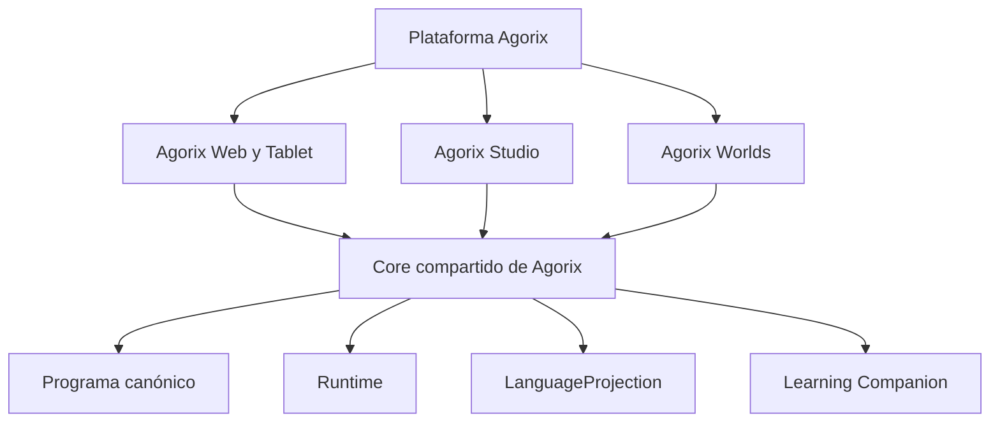

## Agorix Web / Tablet

La superficie principal de aprendizaje y creación es **touch-first**.

La relación visual dominante debería ser:

```text
World + Código
```

y no:

```text
Toolbox + Paneles + Chat + Stage + Código
```

El modelo de interacción buscado es:

- World y Código como las dos superficies persistentes principales;
- **Action Palette** contextual en lugar de una toolbox grande permanente;
- Run / Step / Stop / Reset diseñados para touch;
- propuestas de IA como tarjetas compactas;
- evidencia de ejecución mostrada progresivamente;
- tablet horizontal y vertical como layouts de primera clase;
- PWA instalable como vía principal de entrega.

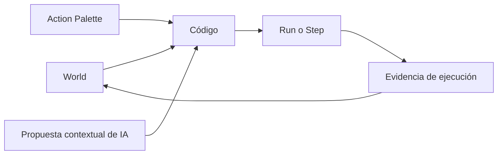

## Agorix Studio

**Agorix Studio** es la experiencia desktop progresiva entregada como extensión de VS Code.

Debe sentirse como un IDE moderno y real adaptado al aprendizaje, no como Scratch incrustado dentro de VS Code.

Sus superficies principales incluyen:

- explorador de misiones/proyectos;
- editor textual;
- World Preview;
- Execution Inspector educativo;
- revisión de propuestas de IA mediante diff;
- Learning Companion integrado con código y evidencia del runtime.

El mismo `ProgramProposal` puede verse como una tarjeta amigable en Tablet y como un diff en Studio, pero su semántica es idéntica.

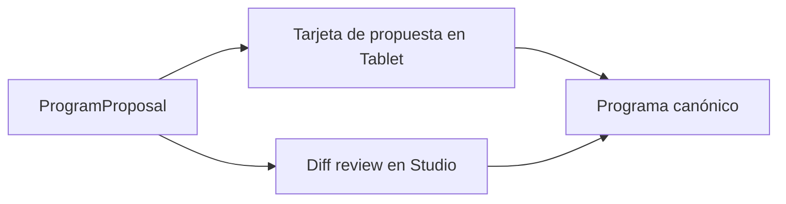

## Agorix Worlds

**Agorix Worlds** aporta la motivación narrativa y visual:

- Espacio;
- Océano;
- Robots;
- Ciudad;
- futuros mundos de la comunidad.

Los Worlds contienen temas, personajes, assets y framing de misiones. No definen un segundo runtime ni un segundo modelo de programación.

## Experiencia progresiva

La interfaz incorpora más capacidad a medida que aumenta la autonomía del alumno.

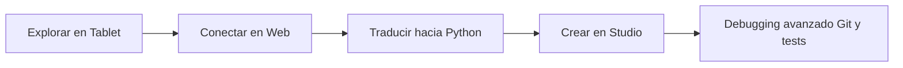

Es una progresión por competencias, no una barrera por edad.

## Dirección visual

Agorix debe sentirse moderno y creativo sin parecer un clon de Scratch.

El lenguaje visual buscado se acerca más a un estudio creativo calmo:

- superficies modernas y suaves;
- profundidad sutil en lugar de bordes negros pesados;
- color semántico en lugar de decoración arcoíris;
- objetivos touch grandes;
- poco chrome permanente;
- la mayor parte de la energía lúdica vive dentro de los Worlds;
- el código mantiene importancia visual desde el comienzo;
- el Learning Companion aparece de forma contextual en vez de dominar permanentemente la pantalla como un chat;
- la UI debe seguir resultando cómoda para un alumno mayor que ya dejó atrás una estética infantil.

Roadmap: [Epic #116 — Agorix Experience & Surface Architecture](https://github.com/Modern-Ash/agorix/issues/116)

Trabajo clave de experiencia:
- [#117 Design system](https://github.com/Modern-Ash/agorix/issues/117)
- [#118 Shell Web tablet-first](https://github.com/Modern-Ash/agorix/issues/118)
- [#119 Agorix Worlds](https://github.com/Modern-Ash/agorix/issues/119)
- [#120 Modelo de interacción touch](https://github.com/Modern-Ash/agorix/issues/120)
- [#38 Agorix Studio](https://github.com/Modern-Ash/agorix/issues/38)
- [#121 Compatibilidad entre superficies](https://github.com/Modern-Ash/agorix/issues/121)

---

# Ciclo de aprendizaje

Una sesión exitosa en Agorix combina programación, experimentación y uso crítico de IA.

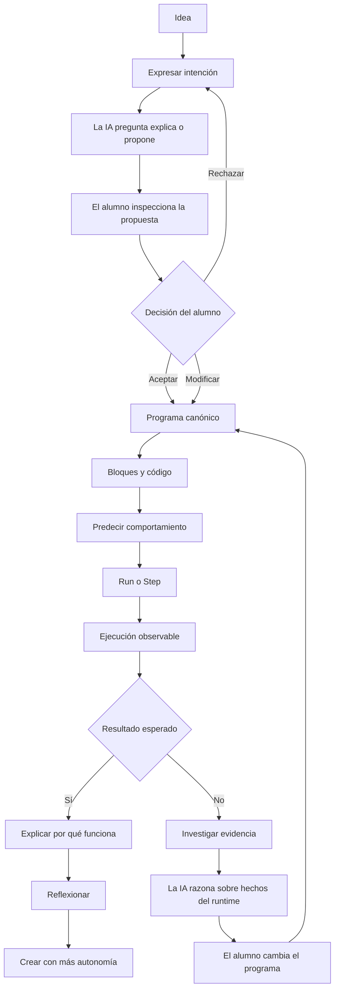

La IA forma parte del proceso de aprendizaje.

**No es la autoridad.**

---

# Las cuatro reglas

## 1. La IA propone. El niño decide.

Una respuesta de IA nunca se convierte automáticamente en el programa del alumno.

Todo cambio originado por IA debe seguir un camino visible:

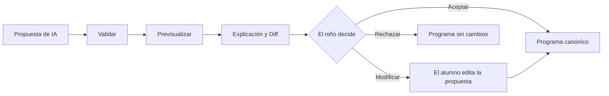

El alumno siempre debería poder responder:

- ¿Qué está proponiendo la IA?
- ¿Qué va a cambiar?
- ¿Por qué lo está sugiriendo?
- ¿Quiero usarlo?

No existe un camino oculto de “la IA lo arregló por vos”.

---

## 2. El runtime demuestra.

Un LLM no decide si un programa funciona.

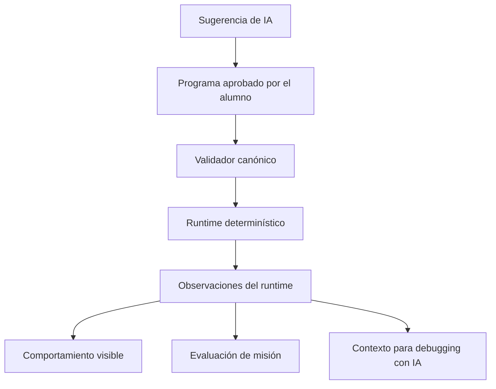

El modelo puede ayudar a interpretar la evidencia.

No puede reemplazarla.

---

## 3. El niño explica.

Terminar una misión no es suficiente.

El alumno debería poder explicar progresivamente:

- ¿Qué hizo que el personaje se moviera?
- ¿Por qué se repitió el loop?
- ¿Qué ocurrió cuando la condición fue falsa?
- ¿Qué estaba mal en una propuesta de IA?
- ¿Por qué funciona la versión corregida?

Agorix prioriza **comprensión sobre finalización**.

---

## 4. Nada ocurre debajo de la alfombra.

Programar nunca debería parecer magia.

El alumno debería poder ver:

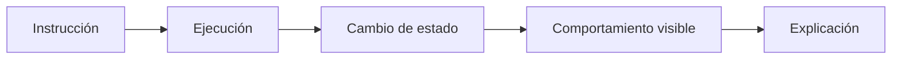

Esto se aplica tanto al código creado por el alumno como al código propuesto por IA.

---

# El código siempre está visible

Agorix evita deliberadamente tratar el código textual como un “modo avanzado” escondido.

La programación visual y la textual son vistas sincronizadas sobre **un único programa canónico**.

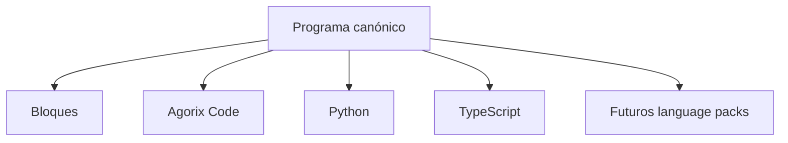

Los bloques no poseen un programa mientras Python posee otro.

Existe una sola fuente de verdad semántica.

### Ejemplo

La idea visual:

```text
repeat 4
    move 10
    turn 90
```

puede verse como **Agorix Code**:

```text
al iniciar
    repetir 4 veces
        mover 10
        girar 90
```

luego como **Python**:

```python
for _ in range(4):
    move(10)
    turn(90)
```

y como **TypeScript**:

```typescript
for (let i = 0; i < 4; i++) {
  move(10);
  turn(90);
}
```

Son representaciones diferentes del **mismo programa**.

---

# Aprendizaje progresivo multi-lenguaje

Agorix se apoya en una idea sencilla:

> **El concepto de programación es más fundamental que la sintaxis usada para expresarlo.**

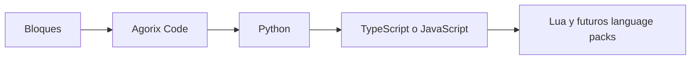

## Agorix Code

**Agorix Code** es la proyección textual amigable para niños que está prevista como primer puente desde los bloques.

Su objetivo es reducir la carga sintáctica inicial sin esconder estructura real de programación:

- secuencia;
- anidamiento;
- repetición;
- decisiones;
- estado;
- descomposición.

Toma inspiración de enfoques de programación gradual como [Hedy](https://www.hedy.org/), pero seguirá siendo una proyección propia de Agorix sobre el programa canónico.

## Python primero

Python es el primer lenguaje textual convencional previsto porque ofrece un puente relativamente directo desde código educativo estructurado hacia programación de propósito general.

## TypeScript después

TypeScript es la segunda proyección principal y además coincide naturalmente con el stack de implementación de Agorix.

## Language packs

Otros lenguajes deben poder agregarse sin modificar la semántica del programa canónico.

El primer spike de extensibilidad está previsto con Lua.

Roadmap: [Epic #65 — Progressive multi-language code learning](https://github.com/Modern-Ash/agorix/issues/65)

---

# Ejecución observable

Ver el código fuente es sólo la mitad de la transparencia.

El alumno también debería poder ver **cómo se ejecuta**.

Agorix evoluciona hacia:

- **Run**
- **Step**
- **Stop**
- **Reset**
- resaltado sincronizado de bloques;
- resaltado sincronizado de código;
- trazas de ejecución comprensibles para niños;
- estado relevante antes y después.

Ejemplo:

```text
Instrucción
  mover 10

Antes
  x = 20

Después
  x = 30

Resultado visible
  el personaje se movió hacia la derecha
```

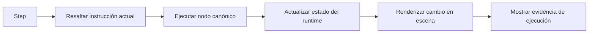

El debugging con IA debe razonar sobre estas observaciones reales del runtime en lugar de inventar hechos de ejecución.

Roadmap: [Epic #64 — Transparent programming and observable execution](https://github.com/Modern-Ash/agorix/issues/64)

---

# Pedagogía antes que automatización

Agorix es primero un producto educativo.

Una capability no es valiosa sólo porque un LLM pueda ejecutarla.

La pregunta relevante es:

> **¿Qué comprende mejor el alumno gracias a que esta capability existe?**

## Aprender haciendo

Los conceptos de programación deben producir comportamientos observables.

En lugar de comenzar con una clase teórica sobre loops, Agorix puede crear una necesidad de repetición y ayudar al alumno a descubrir esa abstracción.

## Andamiaje progresivo

La ayuda de IA debería aumentar gradualmente.

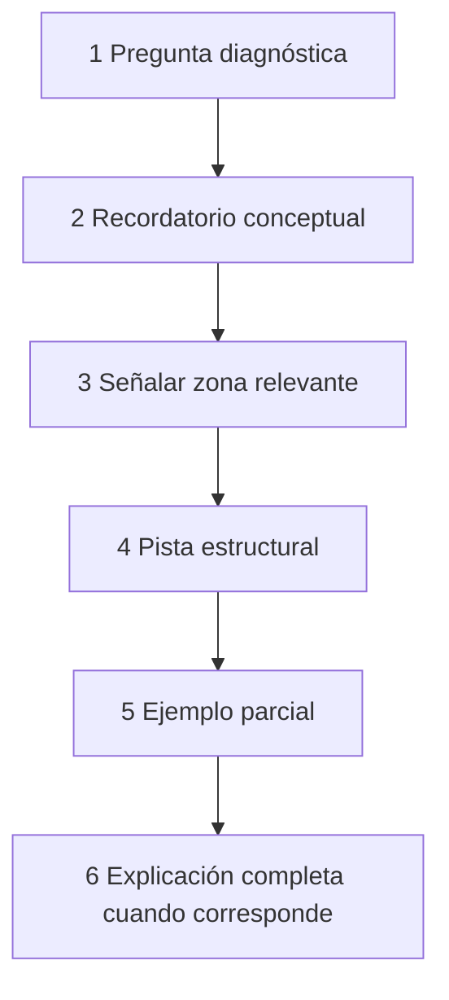

El proveedor no puede saltar directamente a una solución completa si la política pedagógica no lo permite.

## Los errores son material de aprendizaje

Agorix no debe intentar eliminar todos los errores.

Una ejecución fallida genera evidencia que puede inspeccionarse.

En lugar de:

> “Cambiá 3 por 5.”

Agorix debería preferir algo como:

> “La instrucción de movimiento se ejecutó tres veces y el personaje se detuvo antes del objetivo. ¿Qué podríamos cambiar?”

## Predicción antes de ejecutar

Cuando sea pedagógicamente útil, el alumno debería predecir qué hará el programa antes de presionar Run.

## Reflexión después de ejecutar

Después de resolver un problema, Agorix debería pedir al alumno que explique qué cambió y por qué funciona.

Roadmap: [Epic #63 — AI-native product and pedagogical re-foundation](https://github.com/Modern-Ash/agorix/issues/63)

---

# AI Learning Companion

Agorix evoluciona más allá del concepto limitado de “AI Tutor”.

El **Learning Companion**, neutral respecto del proveedor, puede asumir distintos roles pedagógicos.

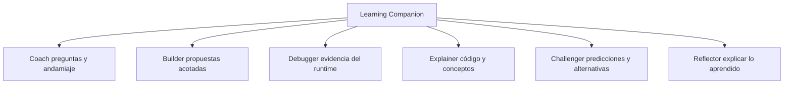

Son capabilities.

No requieren necesariamente modelos diferentes ni agentes diferentes.

Un mismo modelo configurado puede cumplir varios roles, siempre limitado por las políticas del producto y de la pedagogía.

Roadmap: [Epic #66 — AI-native Learning Companion](https://github.com/Modern-Ash/agorix/issues/66)

---

# La alfabetización en IA también es alfabetización en programación

Agorix debería enseñar que:

- la IA puede equivocarse;
- hablar con fluidez no equivale a demostrar;
- las sugerencias deben inspeccionarse;
- el código debe probarse;
- distintos modelos pueden discrepar;
- la evidencia del runtime importa más que la confianza del modelo;
- la decisión final pertenece al alumno.

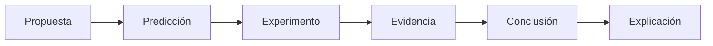

Una actividad avanzada puede comparar deliberadamente dos propuestas de IA y pedir al alumno que prediga y pruebe ambas.

El objetivo **no** es crear un ranking de modelos.

El objetivo es enseñar uso crítico de IA.

Roadmap: [Epic #68 — AI literacy, child safety and learning evidence](https://github.com/Modern-Ash/agorix/issues/68)

---

# Multilingüe por diseño

Agorix busca llegar a niños que hablan distintos idiomas.

Es importante separar dos dimensiones independientes:

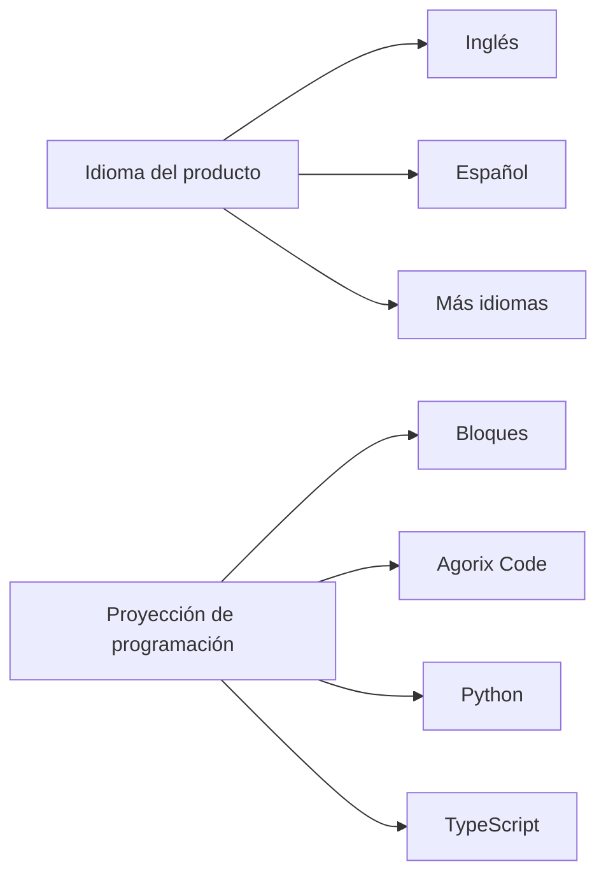

Un alumno puede utilizar:

- interfaz en español;
- misión en español;
- Learning Companion en español;
- código proyectado en Python.

Cambiar la interfaz de español a inglés **no debe cambiar**:

- el programa canónico;
- la semántica;
- el comportamiento del runtime;
- la misión;
- la proyección de lenguaje seleccionada.

Inglés y español son los primeros locales requeridos. La arquitectura debe permitir agregar nuevos idiomas sin tocar el runtime ni crear forks de producto.

Roadmap: [#110 — Make Agorix multilingual: UI, curriculum and Learning Companion i18n/l10n](https://github.com/Modern-Ash/agorix/issues/110)

---

# Open source por diseño

Agorix está pensado como un proyecto **open source**, no como una superficie educativa cerrada alrededor de un servicio propietario de IA.

El proyecto apunta a:

- código fuente auditable;
- reglas pedagógicas auditables;
- límites de integración con IA inspeccionables;
- curriculum extensible por la comunidad;
- language packs extensibles;
- adapters de proveedores extensibles;
- self-hosting cuando sea razonable.

## Licencia: Apache License 2.0

El código fuente y la documentación del repositorio Agorix están licenciados bajo [Apache License 2.0](LICENSE), salvo que un archivo indique otra cosa.

Por qué encaja con Agorix:

- permite uso educativo, de investigación y comercial;
- permite modificación y redistribución;
- incluye grant explícito de patentes;
- favorece un ecosistema de contribuidores;
- encaja bien con adapters, language packs e integraciones;
- es coherente con la dirección abierta del ecosistema Agora.

La gobernanza está documentada en [GOVERNANCE.md](GOVERNANCE.md), y las expectativas de contribución están documentadas en [CONTRIBUTING.md](CONTRIBUTING.md).

Los pesos de modelos, assets de terceros, datasets y proveedores externos pueden tener **sus propias licencias** y no quedan cubiertos automáticamente por la licencia del código fuente de Agorix.

---

# Open-source-first y multi-LLM

Agorix no debería depender de un único proveedor de IA.

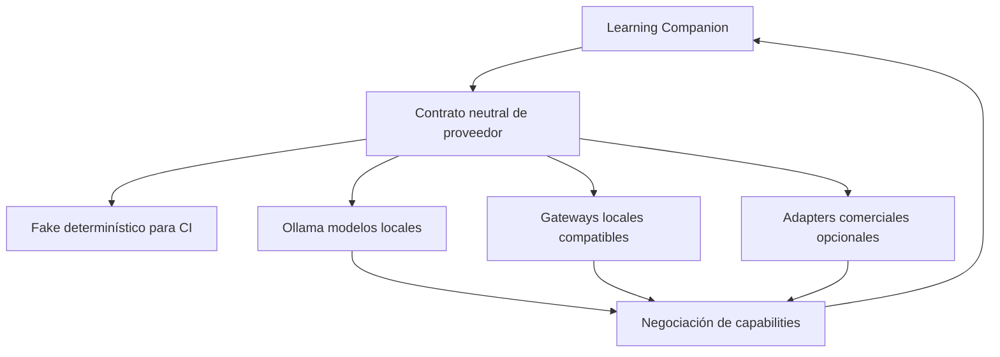

Prioridades:

1. contratos provider-neutral;
2. fake determinístico para CI;
3. modelos locales/abiertos cuando sea razonable;
4. Ollama como camino local de primera clase;
5. gateways compatibles con APIs abiertas para servidores locales;
6. proveedores comerciales opcionales;
7. negociación de capabilities en lugar de suposiciones por vendor.

Un modelo comercial puede rendir mejor para una tarea determinada.

Eso no convierte a su proveedor en parte del modelo de dominio de Agorix.

Roadmap: [Epic #67 — Open-source-first multi-LLM provider architecture](https://github.com/Modern-Ash/agorix/issues/67)

---

# Arquitectura

La arquitectura existente ya aporta gran parte de la base necesaria para esta dirección.

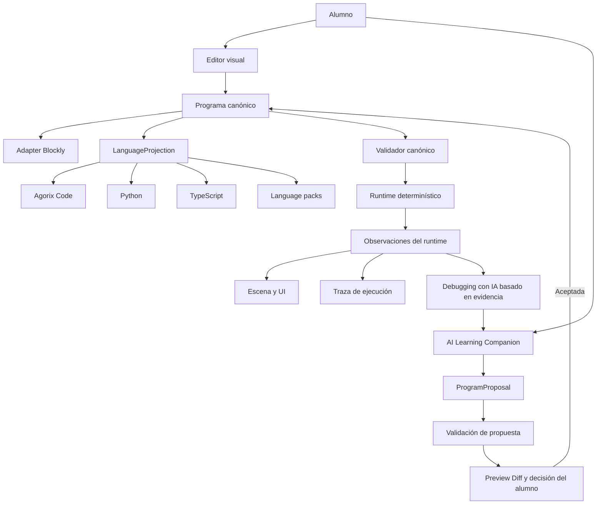

## Programa canónico

El programa canónico es la fuente de verdad de programación.

- Blockly no es el modelo de dominio.
- Python no es el modelo de dominio.
- TypeScript no es el modelo de dominio.
- Una respuesta de LLM no es el modelo de dominio.

## Runtime determinístico

El runtime ejecuta semántica canónica sin `eval`, sin JavaScript arbitrario generado y sin ejecutar código simplemente porque un proveedor lo devolvió.

## LanguageProjection

Los lenguajes textuales son proyecciones determinísticas sobre el estado canónico con mappings estables de nodo canónico a rango textual.

## ProgramProposal

Los cambios generados por IA entran mediante un límite estructurado de propuestas.

Deben ser:

1. validados;
2. previsualizados;
3. comprendidos;
4. aceptados o modificados explícitamente por el alumno.

## Observaciones del runtime

Los hechos objetivos de ejecución pueden alimentar:

- finalización de misiones;
- highlighting;
- trazas;
- debugging;
- grounding de IA;
- evidencia de aprendizaje.

---

# Superficies del producto

Agorix es TypeScript-first, pero el producto es **independiente de la superficie en su nivel de dominio**.

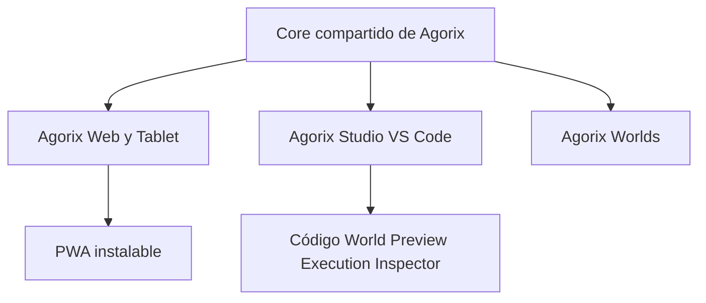

### Web / Tablet

Es la superficie principal de aprendizaje. Es touch-first y está optimizada alrededor de **World + Código**, acciones contextuales y ejecución visible.

[#36](https://github.com/Modern-Ash/agorix/issues/36) sigue la experiencia Web/PWA tablet-first instalable.

### Agorix Studio

Es la superficie avanzada/progresiva en VS Code. Expone flujos más ricos de código, debugging y diff sobre el mismo proyecto canónico.

[#38](https://github.com/Modern-Ash/agorix/issues/38) sigue Agorix Studio.

### Mobile nativo

El empaquetado nativo Android/iOS es **condicional**, no una obligación. Sólo debería agregarse cuando aporte valor concreto por encima de la PWA.

[#37](https://github.com/Modern-Ash/agorix/issues/37) sigue esa evaluación.

La regla es:

> **Los adapters de superficie pueden ser diferentes. La semántica de aprendizaje no.**

---

# Roadmap

El producto AI-native se coordina a través de las épicas centrales de aprendizaje más la nueva arquitectura de experiencia y superficies.

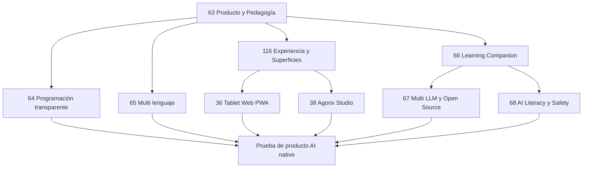

| Épica / Trabajo                                         | Foco                                                       |
| ------------------------------------------------------- | ---------------------------------------------------------- |
| [#63](https://github.com/Modern-Ash/agorix/issues/63)   | Re-fundación AI-native de producto y pedagogía             |
| [#116](https://github.com/Modern-Ash/agorix/issues/116) | Arquitectura de experiencia Tablet, Worlds y Agorix Studio |
| [#64](https://github.com/Modern-Ash/agorix/issues/64)   | Programación transparente y ejecución observable           |
| [#65](https://github.com/Modern-Ash/agorix/issues/65)   | Aprendizaje progresivo multi-lenguaje                      |
| [#66](https://github.com/Modern-Ash/agorix/issues/66)   | Learning Companion AI-native y colaboración gobernada      |
| [#67](https://github.com/Modern-Ash/agorix/issues/67)   | Arquitectura multi-LLM open-source-first                   |
| [#68](https://github.com/Modern-Ash/agorix/issues/68)   | AI literacy, seguridad infantil y evidencia de aprendizaje |
| [#110](https://github.com/Modern-Ash/agorix/issues/110) | UI, curriculum y Learning Companion multilingües           |
| [#36](https://github.com/Modern-Ash/agorix/issues/36)   | Superficie Web/PWA tablet-first instalable                 |
| [#38](https://github.com/Modern-Ash/agorix/issues/38)   | Agorix Studio como extensión VS Code                       |

El orden de ejecución transversal está en:

➡️ [#106 — AI-native backlog execution map for Agora Flow](https://github.com/Modern-Ash/agorix/issues/106)

La implementación existente no se descarta.

El modelo canónico, runtime, observaciones, editor, adapter Blockly, generador inicial de código, sistema de misiones y persistencia siguen siendo la base técnica. La UI actual es un punto de partida de implementación, no la dirección visual final.

---

# Construido con Agora AI-SDLC

Agorix también es un consumidor real y banco de prueba de [Agora AI-SDLC](https://github.com/Modern-Ash/agora-ai-sdlc).

Los issues de GitHub son la cola de trabajo ejecutable.

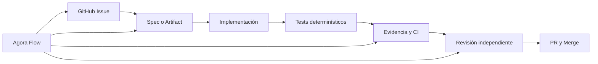

Diferentes agentes pueden ejecutar trabajo acotado bajo los mismos contratos.

Ejemplos:

- Claude / Claude Code;
- OpenAI Codex;
- OpenCode;
- agentes respaldados por Ollama/modelos locales;
- otros runtimes compatibles.

Ningún agente ni proveedor es la autoridad de arquitectura.

### Iniciar un issue

```bash
aisdlc start --issue <issue-number> --agent <runtime>
```

El ejecutor debe:

1. leer el issue;
2. leer los documentos fuente de verdad referenciados;
3. respetar dependencias;
4. crear los artefactos requeridos;
5. implementar sólo el scope aprobado;
6. agregar tests determinísticos;
7. recolectar evidencia;
8. abrir un PR vinculado;
9. obtener revisión independiente;
10. nunca hacer self-merge.

Ver también:

- [AGENTS.md](AGENTS.md)
- [AI-SDLC setup](docs/delivery/AI_SDLC_SETUP.md)
- [Agentic development model](docs/delivery/AGENTIC_DEVELOPMENT.md)

---

# Puesta en marcha para desarrollo

Requisitos:

- Node 22 — ver `.nvmrc`;
- pnpm 9 mediante Corepack.

```bash
git clone https://github.com/Modern-Ash/agorix.git
cd agorix

corepack enable
pnpm install

pnpm dev --filter @agorix/web
pnpm lint
pnpm test
pnpm build
pnpm run verify
```

`pnpm run verify` ejecuta instalación congelada, lint, tests y build con un único código de salida.

---

# Estructura del repositorio

```text
apps/
  web/                UI de referencia con React + Vite
  tutor-api/          Límite actual de IA; evoluciona a Learning Companion API
  mobile/             Límite de packaging con Capacitor

extensions/
  vscode/             Límite para extensión de VS Code

packages/
  program-model/      Programa canónico serializable
  block-editor/       Adapter Blockly
  runtime/            Intérprete determinístico
  stage/              Estado de escena neutral de plataforma
  code-generator/     Evoluciona hacia LanguageProjection
  curriculum/         Misiones y contenido educativo
  tutor-contract/     Evoluciona hacia contrato LearningCompanion
  persistence/        Persistencia versionada
  platform-contract/  Límite de capabilities de plataforma
```

Los paquetes de dominio deben permanecer independientes de frameworks de UI y SDKs de proveedores, salvo que sean explícitamente adapters.

---

# Seguridad y privacidad

Agorix está diseñado para niños, por lo que las restricciones de seguridad forman parte de la arquitectura.

Expectativas principales:

- no se necesita nombre, escuela, dirección, ubicación exacta ni datos de contacto;
- no hay chat público, mensajes privados ni red social en el scope actual;
- no se incluyen secretos de proveedores en bundles del navegador/cliente;
- el texto libre de los niños no se loguea por defecto;
- proveedores remotos reciben sólo el contexto necesario para la capability solicitada;
- el funcionamiento local/offline debe ser posible cuando sea razonable;
- output de IA malformado falla de forma cerrada;
- código generado por un proveedor nunca se ejecuta sólo porque un LLM lo devolvió;
- runtime determinístico y validadores permanecen como límites de confianza.

---

# Referencias de diseño

Agorix no es un clon, pero aprende de ideas fuertes de herramientas educativas existentes:

- [Scratch](https://scratch.mit.edu/) — programación visual creativa e inmediata;
- [Blockly](https://developers.google.com/blockly) — infraestructura de programación visual;
- [Microsoft MakeCode](https://www.microsoft.com/makecode) — puente entre bloques y texto;
- [Hedy](https://www.hedy.org/) — programación textual gradual.

Agorix combina esas ideas alrededor de una pregunta diferente:

> **¿Cómo deberían aprender a programar los chicos cuando la IA ya puede proponer código?**

Nuestra respuesta no es esconder más.

Es hacer **más visible** la colaboración, el programa y la ejecución.

---

# Contribuir

Agorix acepta contribuciones guiadas por issues mediante pull requests de GitHub.

Empezá por [CONTRIBUTING.md](CONTRIBUTING.md), seguí `AGENTS.md`, mantené cambios revisables, agregá tests o checks determinísticos y no hagas self-merge.

La gobernanza y autoridad de maintainers están descritas en [GOVERNANCE.md](GOVERNANCE.md).

---

# Licencia

Agorix está licenciado bajo [Apache License 2.0](LICENSE).

La licencia del código fuente no licencia automáticamente pesos de modelos, assets de terceros, datasets, proveedores alojados ni marcas. Ver [GOVERNANCE.md](GOVERNANCE.md) y [ADR 0002](docs/architecture/adr/0002-open-source-license-and-governance.md).

---

# En un solo diagrama

```mermaid
flowchart LR
    IDEA[Idea] --> TALK[Niño e IA]
    TALK --> PROPOSE[Propuesta visible]
    PROPOSE --> DECIDE[El niño decide]
    DECIDE --> CODE[Bloques y código]
    CODE --> RUN[Run o Step]
    RUN --> EVID[Evidencia]
    EVID --> THINK[Explicar o depurar]
    THINK --> CODE
```

> **La IA propone.**
>
> **El niño decide.**
>
> **El código permanece visible.**
>
> **El runtime ejecuta.**
>
> **La evidencia muestra qué ocurrió.**
>
> **El niño explica.**

Eso es Agorix.
