# Agorix

**Languages:** English · [Español](README.es.md)

> **Open-source, AI-native creative coding for children**
>
> **AI proposes. Child decides. Runtime proves. Child explains.**
>
> **Nothing happens under the rug.**

Agorix is a programming learning environment for children designed for the era of AI.

It is **not** “Scratch plus a chatbot”, and it is not a code generator that hides implementation behind an assistant.

Agorix teaches children to **think, build, inspect, test, debug and explain programs while collaborating with AI**.

| Principle | What it means |
| --- | --- |
| 🧠 **Pedagogy first** | AI exists to improve learning, not merely to finish code faster. |
| 👧 **Child authorship** | AI can propose; the learner decides what becomes part of the program. |
| 👀 **Code always visible** | Blocks and textual code are synchronized views of the same program. |
| ▶️ **Runtime proves** | Program behavior is established by deterministic execution, not by LLM confidence. |
| 🔎 **Nothing hidden** | Proposals, changes, execution and state transitions must be inspectable. |
| 🌍 **Multi-language** | One canonical program can be projected as Agorix Code, Python, TypeScript and future language packs. |
| 🧩 **Multi-LLM** | Providers and models are replaceable adapters, not product authority. |
| 🏠 **Open-source-first** | Local/open models and self-hosting are preferred where practical. |
| 🌐 **Multilingual product** | UI, curriculum and Learning Companion are designed to support multiple human languages without changing program semantics. |

---

## Why Agorix?

Children learning programming today still need to understand sequence, events, loops, conditions, state, functions and debugging.

But they also need new skills:

- expressing intent clearly;
- decomposing a problem;
- inspecting an AI proposal;
- deciding whether to accept, modify or reject it;
- testing what AI suggested;
- distinguishing a confident answer from actual evidence;
- comparing alternative solutions;
- explaining why a program works.

Agorix treats these as **programming skills**, not as a separate “prompt engineering” subject.

The objective is not:

> “Get the program finished as quickly as possible.”

The objective is:

> **Understand what is being built and progressively become more autonomous.**

---

# Learning loop

A successful Agorix session combines programming, experimentation and critical use of AI.

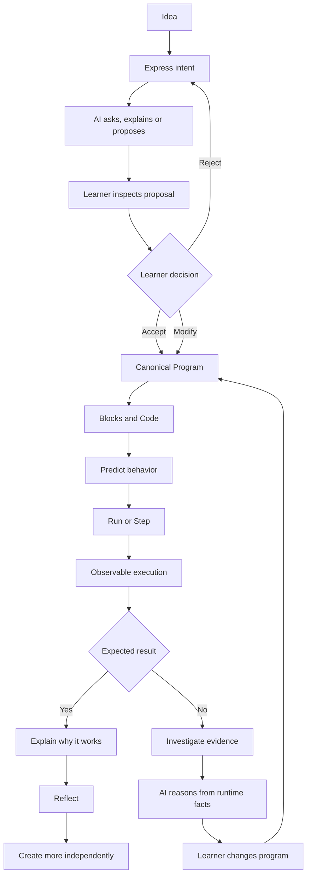

The AI is part of the learning process.

It is **not the authority**.

---

# The four rules

## 1. AI proposes. Child decides.

An AI response never automatically becomes the learner's program.

Every AI-originated program change follows a visible path:

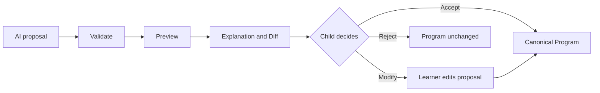

The learner should always be able to answer:

- What is AI proposing?
- What will change?
- Why is it suggesting this?
- Do I want to use it?

There is no hidden “AI fixed it for you” path.

---

## 2. Runtime proves.

An LLM does not decide whether a program works.

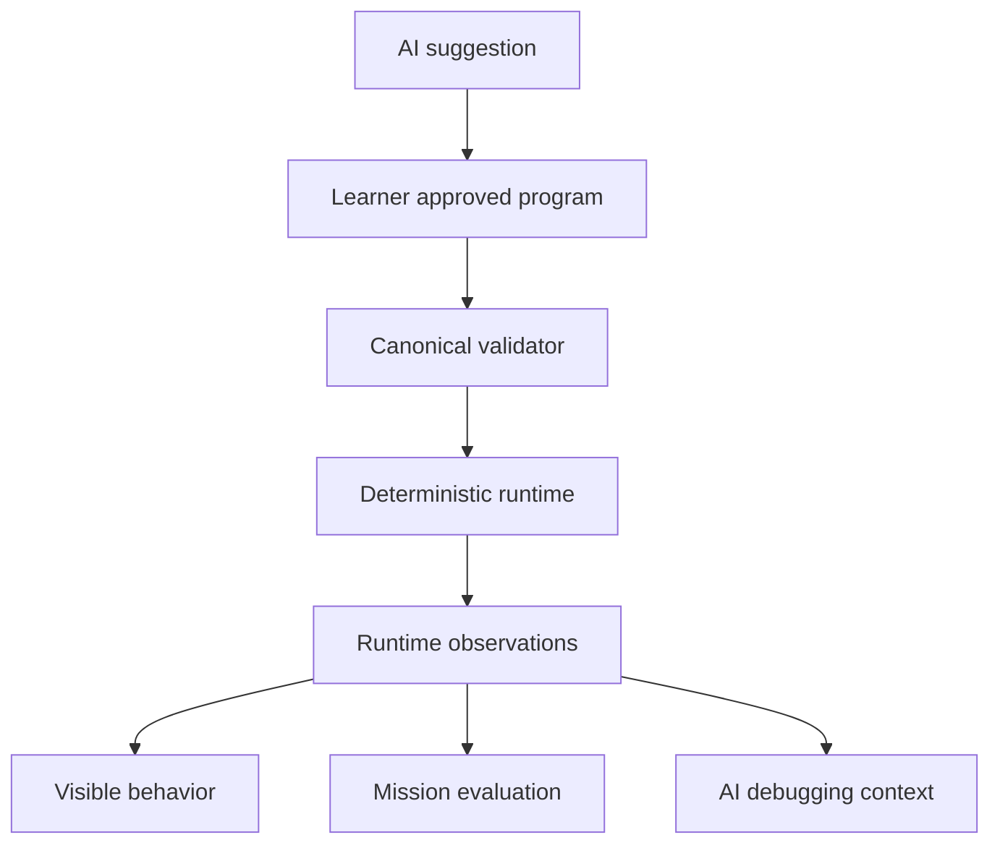

The model can help interpret evidence.

It cannot replace evidence.

---

## 3. Child explains.

Finishing the mission is not enough.

The learner should progressively be able to explain:

- What made the character move?
- Why did the loop repeat?
- What happened when the condition was false?
- What was wrong with an AI proposal?
- Why does the corrected version work?

Agorix values **understanding over completion**.

---

## 4. Nothing happens under the rug.

Programming must never look like magic.

The learner should be able to see:

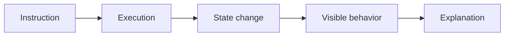

That applies to both human-created and AI-proposed code.

---

# Code is always visible

Agorix deliberately avoids treating textual code as a hidden “advanced mode”.

Visual programming and textual programming are synchronized views over **one canonical program**.

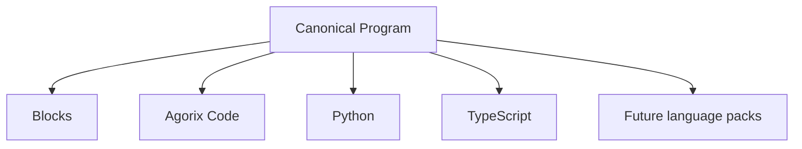

Blocks do not own one program while Python owns another.

There is only one semantic source of truth.

### Example

The visual idea:

```text
repeat 4
    move 10
    turn 90
```

can be shown as **Agorix Code**:

```text
al iniciar
    repetir 4 veces
        mover 10
        girar 90
```

then as **Python**:

```python
for _ in range(4):
    move(10)
    turn(90)
```

and as **TypeScript**:

```typescript
for (let i = 0; i < 4; i++) {
    move(10);
    turn(90);
}
```

They are different representations of the **same program**.

---

# Progressive multi-language learning

Agorix is built around a simple idea:

> **The programming concept is more fundamental than the syntax used to express it.**

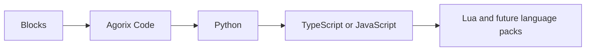

## Agorix Code

**Agorix Code** is the planned child-friendly textual projection.

It should reduce early syntax load while preserving real programming structure:

- sequence;
- nesting;
- repetition;
- decisions;
- state;
- decomposition.

It takes inspiration from gradual-programming approaches such as [Hedy](https://www.hedy.org/), while remaining an Agorix-specific projection over the canonical program.

## Python first

Python is the planned first conventional textual language because it provides a relatively direct bridge from structured educational code to general-purpose programming.

## TypeScript second

TypeScript is the second primary projection and also aligns naturally with the Agorix implementation stack.

## Language packs

Additional languages should be pluggable without changing canonical program semantics.

The first extension spike is planned around Lua.

Roadmap: [Epic #65 — Progressive multi-language code learning](https://github.com/Modern-Ash/agorix/issues/65)

---

# Observable execution

Seeing source code is only half of transparency.

The learner should also be able to see the **program executing**.

Agorix is evolving toward:

- **Run**
- **Step**
- **Stop**
- **Reset**
- synchronized block highlighting;
- synchronized code highlighting;
- child-readable execution traces;
- relevant state before/after.

Example:

```text
Instruction
  move 10

Before
  x = 20

After
  x = 30

Visible result
  the character moved right
```

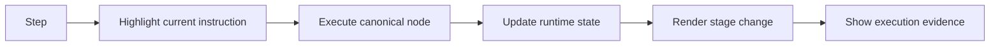

AI debugging must reason from these runtime observations instead of inventing execution facts.

Roadmap: [Epic #64 — Transparent programming and observable execution](https://github.com/Modern-Ash/agorix/issues/64)

---

# Pedagogy before automation

Agorix is an educational product first.

A capability is not valuable merely because an LLM can perform it.

The relevant question is:

> **What does the learner understand better because this capability exists?**

## Learn by making

Programming concepts should produce observable behavior.

Rather than starting with a lecture about loops, Agorix can create a need for repetition and help the learner discover the abstraction.

## Progressive scaffolding

AI help should increase gradually.

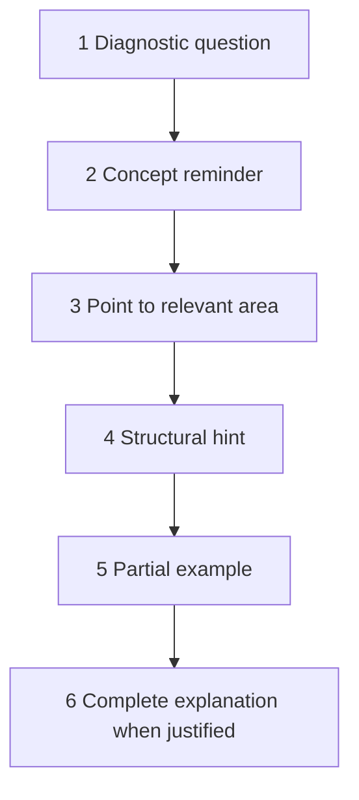

The provider is not allowed to jump directly to a complete solution when pedagogical policy forbids it.

## Mistakes are learning material

Agorix should not optimize mistakes away.

A failed execution creates evidence to inspect.

Instead of:

> “Change 3 to 5.”

Agorix should prefer:

> “The move instruction ran three times and the character stopped before the goal. What could we change?”

## Prediction before execution

Whenever useful, the learner should predict what the program will do before pressing Run.

## Reflection after execution

After solving a problem, Agorix should ask the learner to explain what changed and why it works.

Roadmap: [Epic #63 — AI-native product and pedagogical re-foundation](https://github.com/Modern-Ash/agorix/issues/63)

---

# AI Learning Companion

Agorix is evolving beyond the narrow concept of an “AI Tutor”.

The provider-neutral **Learning Companion** supports several pedagogical roles.

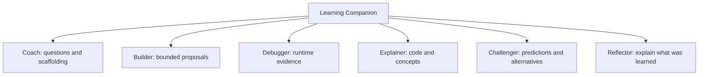

These are capabilities.

They do not require separate models or separate agents.

The same configured model may perform several roles while remaining constrained by product and pedagogical policy.

Roadmap: [Epic #66 — AI-native Learning Companion](https://github.com/Modern-Ash/agorix/issues/66)

---

# AI literacy is programming literacy

Agorix should teach children that:

- AI can be wrong;
- fluent language is not proof;
- suggestions must be inspected;
- code must be tested;
- models may disagree;
- runtime evidence matters more than model confidence;
- the learner owns the final decision.

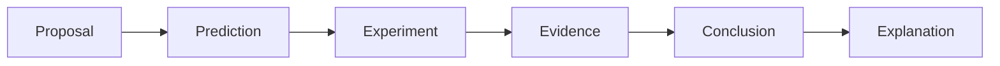

An advanced activity may deliberately compare two AI proposals and ask the learner to predict and test them.

The goal is **not** a model leaderboard.

The goal is critical AI literacy.

Roadmap: [Epic #68 — AI literacy, child safety and learning evidence](https://github.com/Modern-Ash/agorix/issues/68)

---

# Multilingual by design

Agorix aims to reach children beyond a single spoken language.

The product distinguishes two independent dimensions:

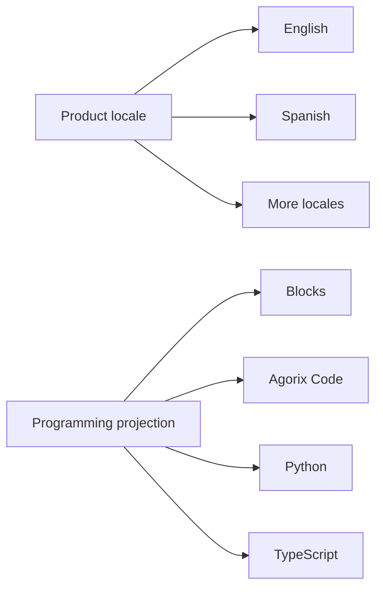

A learner can use a Spanish UI and Learning Companion while viewing the same canonical program as Python. Changing the product locale must never change program semantics, runtime behavior or the selected programming-language projection.

English and Spanish are the initial required locales. The localization architecture should make additional languages straightforward to add.

Roadmap: [#110 — Make Agorix multilingual: UI, curriculum and Learning Companion i18n/l10n](https://github.com/Modern-Ash/agorix/issues/110)

---

# Open source by design

Agorix is intended to be an **open-source project**, not a closed educational surface around a proprietary AI service.

The project aims for:

- auditable source code;
- auditable pedagogical rules;
- inspectable AI integration boundaries;
- community-extensible curriculum;
- community-extensible language packs;
- community-extensible provider adapters;
- self-hosting where practical.

## Preferred license: Apache License 2.0

The preferred licensing direction is **Apache-2.0**.

Why it fits Agorix:

- permissive use in education, research and commercial products;
- modification and redistribution are allowed;
- explicit patent grant;
- contributor-friendly ecosystem model;
- good fit for adapters, language packs and integrations;
- consistent with the open ecosystem direction of the broader Agora work.

**Important:** the repository is not formally Apache-2.0 until the root `LICENSE` and governance artifacts are committed.

That work is tracked in [#73 — Formalize Agorix open-source license, governance and contribution model](https://github.com/Modern-Ash/agorix/issues/73).

Model weights, third-party assets and external providers may have their **own licenses** and are not automatically covered by the Agorix source-code license.

---

# Open-source-first and multi-LLM

Agorix should not depend on a single AI vendor.

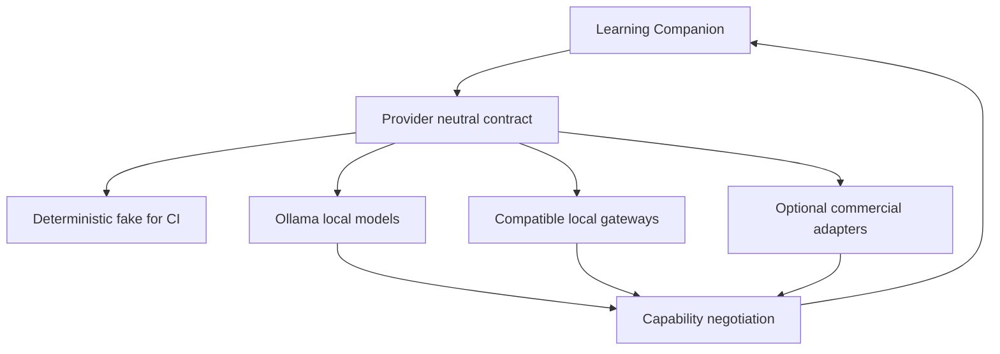

Priorities:

1. provider-neutral contracts;
2. deterministic fake provider for CI;
3. local/open models where practical;
4. Ollama as a first-class local path;
5. OpenAI-compatible gateways for local/open inference servers;
6. optional commercial providers;
7. capability negotiation rather than vendor assumptions.

A commercial model may perform better for a particular task.

That does not make its vendor part of the Agorix domain model.

Roadmap: [Epic #67 — Open-source-first multi-LLM provider architecture](https://github.com/Modern-Ash/agorix/issues/67)

---

# Architecture

The existing architecture already provides much of the foundation required for this direction.

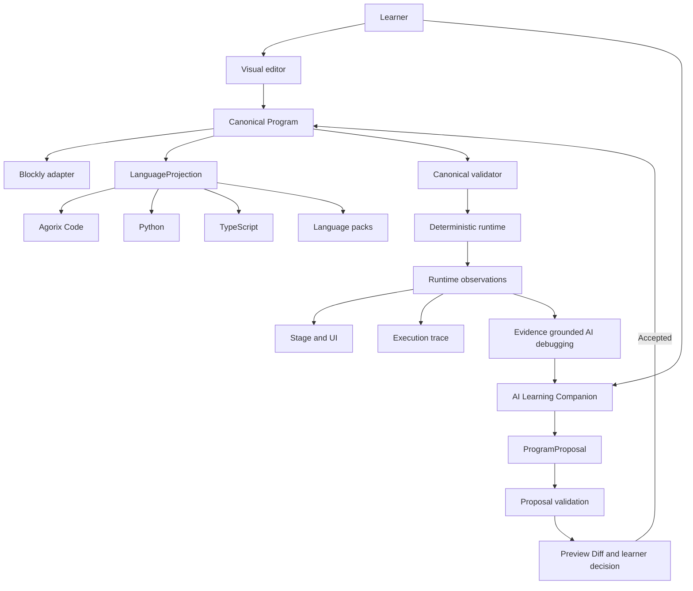

## Canonical Program

The canonical program is the programming source of truth.

- Blockly is not the domain model.
- Python is not the domain model.
- TypeScript is not the domain model.
- An LLM response is not the domain model.

## Deterministic Runtime

The runtime executes canonical semantics without `eval`, arbitrary generated JavaScript or provider-generated executable code.

## LanguageProjection

Textual languages are deterministic projections over canonical state with stable canonical-node-to-text mappings.

## ProgramProposal

AI-generated program changes enter through a structured proposal boundary.

They must be:

1. validated;
2. previewed;
3. understood;
4. explicitly accepted or modified by the learner.

## Runtime observations

Objective execution facts support:

- mission completion;
- highlighting;
- traces;
- debugging;
- AI grounding;
- learning evidence.

---

# Product surfaces

Agorix is TypeScript-first.

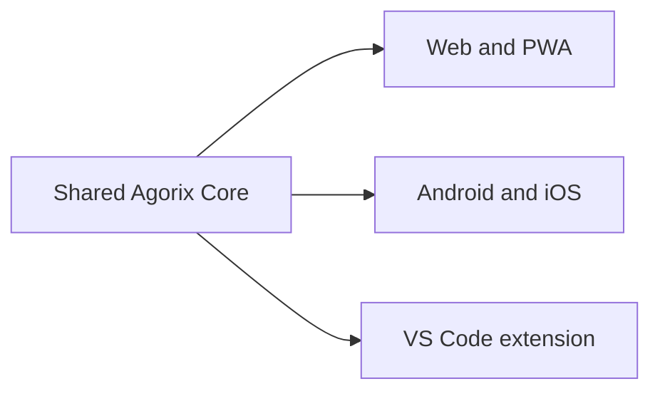

Current priority is the **AI-native browser learning loop**.

Platform breadth must not outrun product and pedagogical validation.

---

# Roadmap

The AI-native re-foundation is organized into six primary epics.

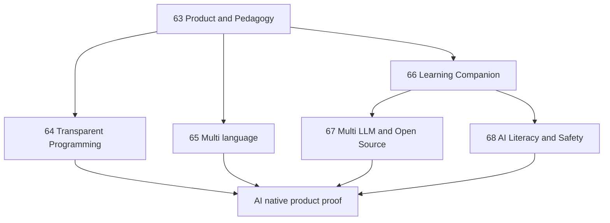

| Epic | Focus |
| --- | --- |
| [#63](https://github.com/Modern-Ash/agorix/issues/63) | AI-native product and pedagogical re-foundation |
| [#64](https://github.com/Modern-Ash/agorix/issues/64) | Transparent programming and observable execution |
| [#65](https://github.com/Modern-Ash/agorix/issues/65) | Progressive multi-language code learning |
| [#66](https://github.com/Modern-Ash/agorix/issues/66) | AI-native Learning Companion and governed collaboration |
| [#67](https://github.com/Modern-Ash/agorix/issues/67) | Open-source-first multi-LLM provider architecture |
| [#68](https://github.com/Modern-Ash/agorix/issues/68) | AI literacy, child safety and learning evidence |

The cross-epic execution sequence is tracked in:

➡️ [#106 — AI-native backlog execution map for Agora Flow](https://github.com/Modern-Ash/agorix/issues/106)

Existing implementation is not being discarded.

The canonical model, runtime, observations, editor, Blockly adapter, initial code generator, mission system and persistence remain the technical foundation.

---

# Built with Agora AI-SDLC

Agorix is also a real-world consumer and proving ground for [Agora AI-SDLC](https://github.com/Modern-Ash/agora-ai-sdlc).

GitHub issues are the executable work queue.

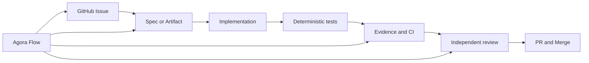

Different agents can execute bounded work under the same contracts.

Examples include:

- Claude / Claude Code;
- OpenAI Codex;
- OpenCode;
- Ollama-backed/local agents;
- other compatible runtimes.

No coding agent or provider is the architecture authority.

### Start an issue

```bash
aisdlc start --issue <issue-number> --agent <runtime>
```

The executor should:

1. read the issue;
2. read referenced source-of-truth documents;
3. respect dependencies;
4. create required artifacts;
5. implement only approved scope;
6. add deterministic tests;
7. collect evidence;
8. open a linked PR;
9. obtain independent review;
10. never self-merge.

See:

- [AGENTS.md](AGENTS.md)
- [AI-SDLC setup](docs/delivery/AI_SDLC_SETUP.md)
- [Agentic development model](docs/delivery/AGENTIC_DEVELOPMENT.md)

---

# Developer bootstrap

Prerequisites:

- Node 22 — see `.nvmrc`;
- pnpm 9 through Corepack.

```bash
git clone https://github.com/Modern-Ash/agorix.git
cd agorix

corepack enable
pnpm install

pnpm dev --filter @agorix/web
pnpm lint
pnpm test
pnpm build
pnpm run verify
```

`pnpm run verify` performs a frozen install plus lint, tests and build with one exit code.

---

# Repository layout

```text
apps/
  web/                React + Vite reference UI
  tutor-api/          Current AI server boundary; evolving to Learning Companion API
  mobile/             Capacitor packaging boundary

extensions/
  vscode/             VS Code extension boundary

packages/
  program-model/      Canonical serializable program
  block-editor/       Blockly adapter
  runtime/            Deterministic interpreter
  stage/              Platform-neutral stage state
  code-generator/     Evolving into LanguageProjection
  curriculum/         Missions and learning content
  tutor-contract/     Evolving into LearningCompanion contract
  persistence/        Versioned project storage
  platform-contract/  Platform capability boundary
```

Domain packages must remain independent from UI frameworks and provider SDKs unless they are explicitly adapter packages.

---

# Safety and privacy

Agorix is designed for children, so safety constraints belong in the architecture.

Core expectations:

- no name, school, address, exact location or contact data required;
- no public chat/DM/social network in the current scope;
- no provider secrets in browser/client bundles;
- raw child free text is not logged by default;
- remote providers receive only capability-required context;
- local/offline operation should be possible where practical;
- malformed AI output fails closed;
- provider-generated source is never executed merely because an LLM returned it;
- deterministic runtime and validators remain trust boundaries.

---

# Design references

Agorix is not a clone, but it learns from strong ideas in existing educational tools:

- [Scratch](https://scratch.mit.edu/) — creative, immediate visual programming;
- [Blockly](https://developers.google.com/blockly) — visual programming infrastructure;
- [Microsoft MakeCode](https://www.microsoft.com/makecode) — blocks/text bridging;
- [Hedy](https://www.hedy.org/) — gradual textual programming.

Agorix combines those ideas around a different central question:

> **How should children learn programming when AI can already propose code?**

Our answer is not to hide more.

It is to make the collaboration, the program and the execution **more visible**.

---

# Contributing

Agorix is being prepared as an open-source project.

Contribution and governance rules are being formalized in [#73](https://github.com/Modern-Ash/agorix/issues/73).

Until those artifacts are merged:

- use GitHub issues as the work queue;
- follow `AGENTS.md`;
- keep changes reviewable;
- add deterministic tests;
- do not self-merge;
- do not introduce vendor lock-in or hidden AI mutation paths.

---

# License

**Preferred direction: Apache License 2.0.**

The repository should only be described as formally Apache-2.0 licensed after the root `LICENSE` file is committed.

See [#73](https://github.com/Modern-Ash/agorix/issues/73).

---

# In one diagram

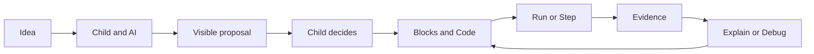

> **AI proposes.**
>
> **Child decides.**
>
> **Code stays visible.**
>
> **Runtime executes.**
>
> **Evidence shows what happened.**
>
> **Child explains.**

That is Agorix.
