# Agorix Studio Agent

Traces to epic #242 and issue #243. Builds on #204, #210 and #211.

## Purpose

Agorix explores a new way for children to learn programming in the AI era.

The goal is not to teach children how to ask an AI to write programs for them. The goal is to teach them how to **think, build, inspect, test, debug and explain programs while collaborating with AI**.

Programming is changing. Writing every instruction manually is no longer the only way software can be created. Learners increasingly need to understand how to express intent, decompose problems, delegate bounded work, inspect generated proposals, question them, test them against evidence and remain capable of explaining what was built.

Agorix treats those abilities as programming skills.

The Studio Agent is the AI-native layer of Agorix Studio for learners who already handle the Web experience. It introduces AI as a participant in the programming workflow without making AI the author, authority or source of truth.

The learner remains responsible for intent, decisions and understanding.

The agent may help build.

The learner must remain able to understand, question and verify what is built.

> **AI proposes. Child decides. Runtime proves. Child explains.**

This is not merely a safety rule. It is the Agorix learning model.

## Learning programming in the AI era

Traditional programming education often follows:

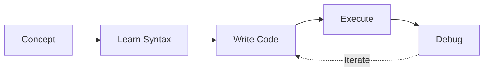

Agorix introduces a broader learning loop:

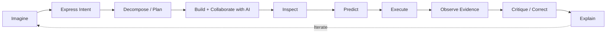

Code remains fundamental. AI does not remove the need to understand programs. Instead, generated code and proposals become additional objects that learners must learn to inspect, reason about and verify.

Agorix therefore does not teach "prompt engineering" as the primary skill. It teaches durable skills: expressing intent clearly, decomposing problems, delegating bounded work, understanding code and program structure, inspecting AI proposals, predicting behavior, testing assumptions, distinguishing fluent explanations from evidence, comparing alternatives and trade-offs, correcting mistakes and explaining why a program works.

## Product position

Agorix is not Scratch with AI attached. It is not an AI code generator for children. It is not a chatbot that happens to know programming.

Agorix is an open learning environment for exploring how children can learn programming when both humans and artificial systems can contribute to building software.

| Prefer        | Over              |
| ------------- | ----------------- |
| Understanding | Completion        |
| Evidence      | Confidence        |
| Learner       | Agent             |
| Local / open  | Dependency        |
| Inspection    | Hidden automation |
| Learning      | Token consumption |

A feature that lets AI produce more while causing the learner to understand less is not automatically an improvement.

## Learner stages served

| Stage       | Studio Agent role                                                                |
| ----------- | -------------------------------------------------------------------------------- |
| Collaborate | Offers bounded proposals; learner evaluates before accepting.                    |
| Create      | Coaches planning, review and debugging; does not replace learner reasoning.      |
| Critique    | Surfaces alternatives and trade-offs; learner decides and defends with evidence. |

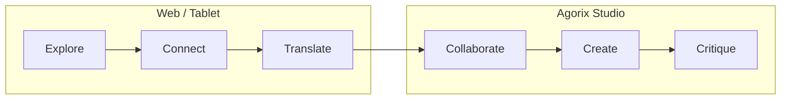

The progression is competency-driven, not age-driven.

## Pedagogical paradigm: Director and Auditor

The learner **directs** and **audits**. The agent proposes bounded work.

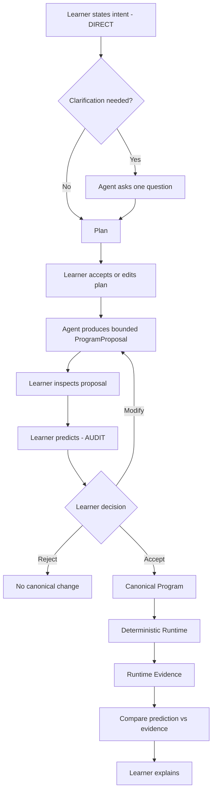

The learner retains control over intent, decomposition, acceptance, verification, correction and explanation. AI-generated work remains provisional until the learner accepts it.

## Code remains visible

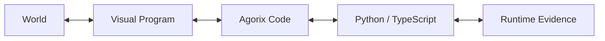

Different representations are projections of the same canonical program. AI may reduce mechanical effort. It must not remove conceptual visibility.

## Rules carried over from PEDAGOGY.md

- Questions and hints precede complete solutions.
- A complete solution is available only after repeated failure and explicit learner request.
- The agent never changes the accepted program on its own.
- The agent never hides code or proposal diffs.
- The agent never claims behavior the runtime has not observed.
- Mission completion never depends on AI judgment.
- No personal data is requested for personalization.
- Reflection never blocks basic completion.
- AI assistance must preserve learner authorship and inspectability.
- Higher AI capability must not silently reduce learner participation.

## Alternatives and honesty

When the agent offers alternatives, they are real approaches with real trade-offs. The agent never plants bugs or deliberately misleads the learner. Abstention is a valid system outcome.

## Interaction model

Two primary entry modes are used; a chat panel is not the primary surface.

### Ambient

Status indicator, CodeLens, code actions, selected/erroring nodes, node-anchored hints, ghost nodes and runtime evidence.

### Intent bar

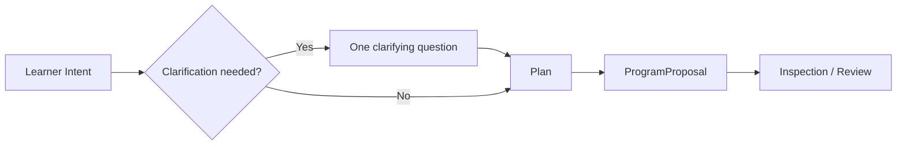

Agent output should primarily be structured, inspectable data. Long free-form text is secondary and available on demand.

## Proactivity policy

**Silence is a first-class outcome.** The default is to say nothing.

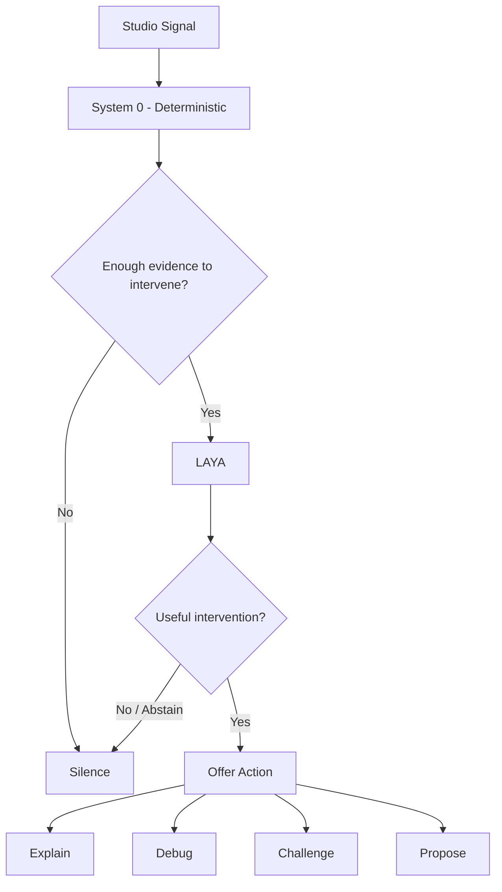

The agent stays silent while the learner is running, stepping or typing; after declines/cooldowns; with weak evidence; when AI is disabled; when budget is exhausted; or when intervention has no meaningful pedagogical value.

## Cost and openness architecture

Agorix must not require a commercial AI service to provide a meaningful AI-era learning experience.

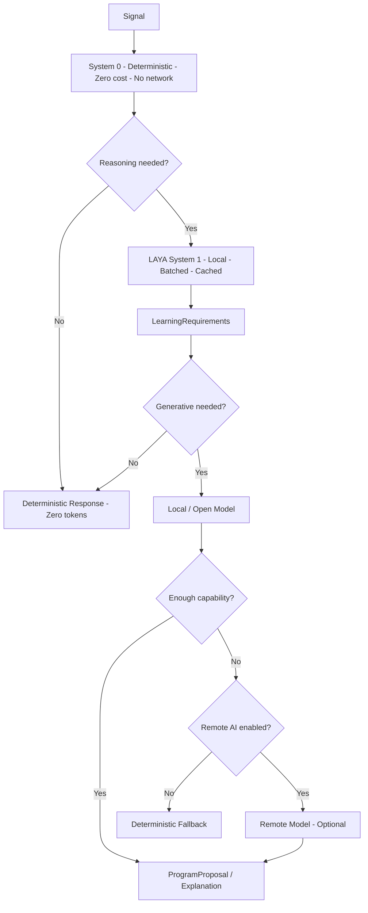

LAYA decides whether generation is necessary, what reasoning tier is appropriate and how much context is justified. It does not generate learner-facing text.

## Zero-cost learning invariant

A complete core learning journey MUST remain possible without a paid AI subscription, commercial provider, API key, cloud AI or provider credentials.

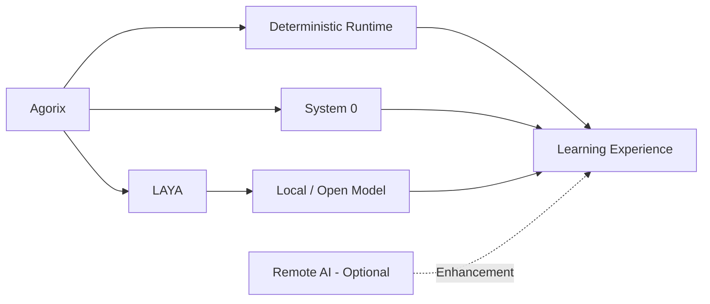

> **Local works. Cloud improves.**

Remote AI requires explicit opt-in. When no suitable local generative model exists, Agorix degrades transparently to deterministic scaffolding rather than requiring a paid service.

## Open-source invariant

Agorix is open-source-first: provider-independent, model-independent, self-hostable where practical, inspectable, extensible, forkable and usable without commercial lock-in.

Providers and models are adapters. They are not part of the pedagogical contract.

## Context contract

The agent sees only bounded, sanitized context: mission id/version, learning target, canonical program snapshot, selected node ids/ranges, deterministic runtime observations, scaffold history, locale and learner text explicitly submitted for the current intent.

## Proposal pipeline

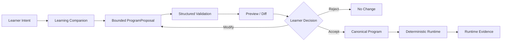

The agent never mutates canonical state directly. Generated source is never executed merely because a model produced it.

## Prediction policy

Prediction is a learning mechanism, not transactional bureaucracy.

> **Prediction is pedagogically triggered, not mechanically required.**

## Availability

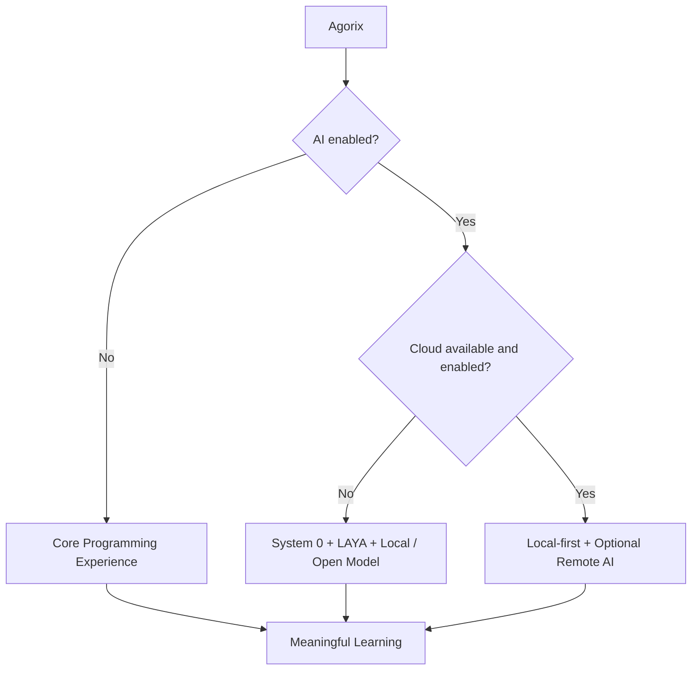

> **AI OFF → Agorix works.**
>
> **AI ON + NO CLOUD + NO PAID PROVIDER → Agorix still provides a meaningful AI-era learning experience.**

## Privacy and child safety

Never log learner free text, names, emails, precise age, school, location, file paths, account/session identifiers, provider credentials or raw model output. Storage is local-first.

Children are learners, not data products.

## Community direction

Community participation focuses on creating and improving learning material rather than creating social profiles for children.

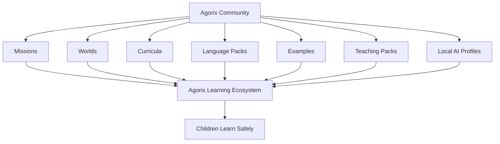

> **The community builds the learning ecosystem. Children use it safely.**

## Canvas

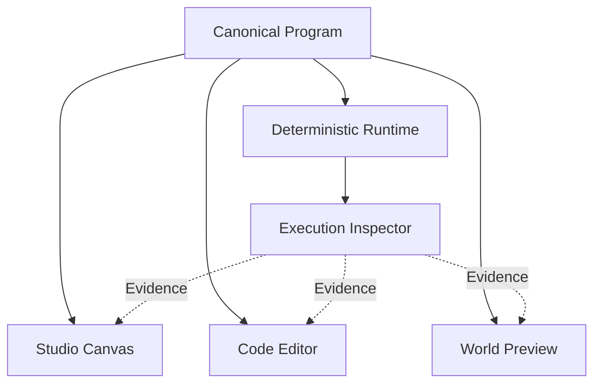

No projection owns independent program state.

## Work breakdown

- Epic #242
- Foundations #243
- Phase 1 Agent core #244-#251
- Phase 2 Canvas #252-#255
- Phase 3 Agent on canvas #256-#258
- Release gate #259

## Release principles

Release evidence should include AI disabled, AI local/offline, AI remote, provider unavailable, budget exhausted, proposal rejected/modified, incorrect AI proposal detected by runtime, prediction vs evidence and learner explanation.

The release gate should prove a **Zero-Cost / Offline AI Journey**.

## Workbench agent slice

Implemented in the Workbench: intent bar, deterministic tasks, provider-backed intent planning when configured, deterministic fallback, plan/proposal flow, ghost blocks, Accept/Reject, prediction, deterministic Run, prediction/evidence comparison, optional explanation, agent agreements, supervised/bounded mode, help-level ceiling, non-PII AgentEvents, local educator evidence export and English/Spanish chrome.

Runtime completion is explicitly not a grade or proof of understanding.

## Ambient presence slice

Implemented in the VS Code host: quiet-by-default status, available/working/off/budget-capped states, quick-pick offers, CodeLens/actions, System-0 proactive policy, first-step, repeated-pattern, runtime-error, stalled, repeated-error, optional LAYA veto, node-anchored canvas hints, decline/ignore memory, budget checks and agent-agreement checks.

No provider call occurs merely because an ambient signal was detected.

## Not yet implemented

- Mission Spec editing.
- Full community learning-content packaging.
- Release evidence for the complete Zero-Cost / Offline AI Journey.

## North Star

Agorix exists to explore and build **how children can learn programming in the era of artificial intelligence while preserving understanding, autonomy and critical thinking**.

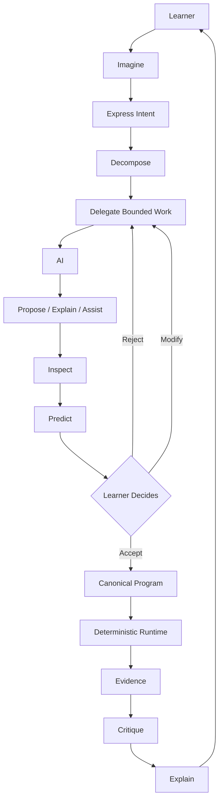

> **AI proposes. Child decides. Runtime proves. Child explains.**

The objective is not to prepare children to compete with AI at typing code.

The objective is to prepare them to **understand and create computational systems in a world where AI is one of the tools capable of helping build them**.

That is the programming paradigm Agorix is designed to teach.
