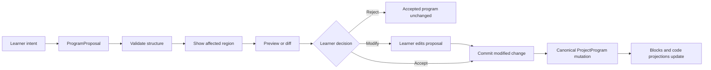
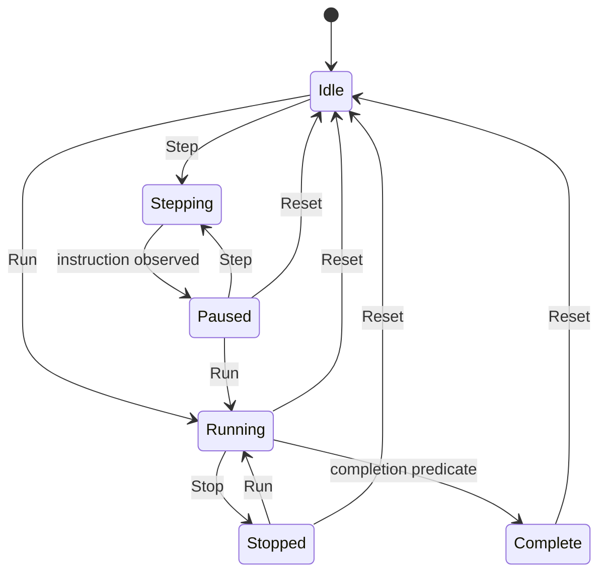

# Transparent programming UX contract

Issue #74 defines how Agorix makes programming causality visible before #75-#78 implement the interaction details. The contract applies to Web, Tablet and Agorix Studio.

Core invariant:

```text
intention
  -> proposed program change
  -> accepted program
  -> current instruction
  -> runtime state transition
  -> visible result
```

## Authority model

| State            | Authority                     | Learner-visible signal                                          | May mutate canonical program?   |
| ---------------- | ----------------------------- | --------------------------------------------------------------- | ------------------------------- |
| Intent           | Learner                       | prompt, selected action, direct edit target                     | No                              |
| Proposal         | AI/scaffold/human draft       | proposal label, affected region, preview/diff, uncertainty copy | No                              |
| Decision         | Learner                       | accept, modify or reject action                                 | Only accept/modify may commit   |
| Accepted program | Canonical `ProjectProgram`    | blocks and code projection                                      | Yes, by explicit learner action |
| Execution        | Runtime                       | Run/Step/Stop/Reset state, current instruction highlight        | No                              |
| Evidence         | Runtime observations          | trace, before/after state, visible world result                 | No                              |
| Explanation      | Learning Companion or UI copy | explanation grounded in evidence                                | No                              |

AI can propose, explain, challenge and summarize. It is never the authority for accepted state or mission completion.

## Program mutation paths

Every path below must be visible, deterministic and testable.

| Path                        | Visible sequence                                                                                              | Canonical mutation boundary                               | Required learner control                       |
| --------------------------- | ------------------------------------------------------------------------------------------------------------- | --------------------------------------------------------- | ---------------------------------------------- |
| Direct block/card insertion | Action Palette or toolbox action -> insertion target -> new accepted block/code projection                    | Immediately after learner activates the insertion command | Add/cancel where applicable                    |
| Numeric edit                | select value -> edit field -> Apply/Cancel -> updated accepted block/code projection                          | Only on Apply or committed keyboard equivalent            | Apply and Cancel near field                    |
| Reorder                     | Up/Down or reorder command -> preview/selection -> updated accepted order/code                                | On explicit reorder activation                            | Move up/down; keyboard reachable               |
| Delete                      | select block/card -> delete command -> confirmation when destructive context needs it -> updated program/code | On explicit delete activation                             | Delete plus recoverable undo where implemented |
| AI proposal accept          | intent -> proposal -> affected region -> explanation -> preview/diff -> Accept                                | On Accept only                                            | Accept, Modify, Reject                         |
| AI proposal modify          | intent -> proposal -> learner edits proposal/direct region -> reviewed result -> accepted mutation            | On learner's explicit modified commit                     | Modify, Apply, Cancel                          |
| AI proposal reject          | proposal -> Reject -> proposal dismissed                                                                      | Never                                                     | Reject                                         |
| Studio diff accept          | intent/proposal -> diff review -> affected canonical nodes -> Accept selected/all                             | On diff accept action                                     | Accept, modify/reject affordance               |
| Persistence reload          | stored canonical project -> validation -> projected blocks/code                                               | No new mutation; load only                                | Explicit error on incompatible schema          |

Forbidden paths:

- provider output directly mutates `ProjectProgram`;
- chat/explanation text is treated as executable learner program;
- proposal preview silently updates accepted blocks/code;
- runtime result or mission completion is inferred from AI confidence;
- surface-specific IDs become canonical program state.

## AI proposal sequence

All AI-originated programming changes use this visible sequence:

1. learner intent;
2. proposal summary;
3. affected blocks/code/canonical region;
4. human-readable explanation;
5. diff or preview;
6. Accept / Modify / Reject;
7. canonical mutation only after accepted or modified commit;
8. runtime evidence after execution.



Proposal copy must use provisional language such as "suggestion", "try", or "this may help". It must not use completion/success styling before acceptance.

## Execution semantics

### Run

Run validates the accepted canonical program, resets runtime state to the mission start state for a fresh run, executes deterministically and emits runtime observations. Run does not execute generated textual code or provider output.

### Step

Step advances exactly one observable instruction boundary from the accepted canonical program.

Rules:

- current instruction is highlighted in blocks and generated code where mapping exists;
- repeat highlights the loop controller when entering/checking the loop, then highlights each body instruction per iteration;
- condition highlights the `if` instruction and shows the predicate result before executing the chosen branch/body;
- Step emits before/after state when the instruction changes world state;
- Step on completed/stopped execution is disabled or restarts only through an explicit Run/Reset choice;
- AI may explain the highlighted instruction but may not invent unobserved state.

### Stop

Stop halts execution at the current state and marks the run as stopped. It does not delete or revert the accepted program.

### Reset

Reset stops execution and returns runtime/stage state to the mission start state. It does not change the accepted program, proposal queue, generated code projection or saved canonical project.



## Child-readable trace

A trace row should answer four questions without developer overload:

| Question        | Web/Tablet example           | Studio example                    |
| --------------- | ---------------------------- | --------------------------------- |
| What ran?       | "Move 160 steps"             | statement type and canonical node |
| Where is it?    | highlighted card + code line | editor range + inspector node     |
| What changed?   | "x: 52 -> 212"               | before/after world state row      |
| What did I see? | sprite moved toward goal     | World Preview frame               |

Advanced object dumps are Studio/debug details, not beginner default UI.

## Code visibility rules

Code is part of the normal learning flow, not an advanced export.

| Surface             | Required rule                                                                                                                                                            |
| ------------------- | ------------------------------------------------------------------------------------------------------------------------------------------------------------------------ |
| Web desktop/normal  | World, program cards/blocks and generated code remain in the primary layout during edit, proposal review, run, debug and reflection.                                     |
| Tablet landscape    | World and Code are dominant; proposal cards/Action Palette appear contextually without covering Code.                                                                    |
| Tablet portrait     | Stack order keeps World/active context first and Code immediately reachable/visible as a persistent band; proposal sheets may not hide Code as the only way to continue. |
| Narrow web viewport | Code band remains visible and internally scrollable; it must not be hidden behind tabs or an advanced toggle.                                                            |
| Agorix Studio       | Textual code is first-class. Proposal review uses diff/affected ranges; runtime evidence appears in World Preview and Execution Inspector.                               |

If a future surface cannot show full code and world simultaneously, it must still show a code presence/active line and provide one-step access without losing proposal or runtime context.

## Visual and provenance states

Use the design language from `docs/product/DESIGN_SYSTEM.md`:

- Proposal: AI/provisional accent, proposal label, uncertainty copy, affected region and accept/modify/reject controls.
- Accepted program: normal program/block/code surface; no AI success styling.
- Executing instruction: runtime/evidence accent, current instruction marker, non-color-only label/icon.
- Runtime evidence: trace/rail/state bubble tied to deterministic observations.
- Completion: success tied to completion predicate, not full-screen takeover that hides editor context.

These states must be distinguishable by text/icon/provenance, not color alone.

## Cross-surface mapping

Semantics are identical; affordances differ.

| Concept                  | Web / Tablet                                | Agorix Studio                                    |
| ------------------------ | ------------------------------------------- | ------------------------------------------------ |
| ProgramProposal          | proposal card or bottom sheet               | diff review with affected ranges                 |
| Affected region          | highlighted card + code span                | editor range + canonical node                    |
| Accept / Modify / Reject | large touch targets in proposal card        | IDE commands/buttons in diff review              |
| Current instruction      | highlighted card + code line + state bubble | code range + Execution Inspector row             |
| RuntimeObservation       | compact trace/state bubble                  | inspector row + World Preview frame              |
| Explanation              | contextual companion prompt near evidence   | side panel/commentary grounded in inspector data |

Presentation differences must not change canonical program, runtime semantics, proposal semantics or project compatibility.

## Touch and keyboard requirements

This contract inherits `docs/product/INTERACTION_MODEL.md`:

- critical actions work with touch and keyboard;
- drag is optional for First Mission editing;
- Action Palette is the primary tablet insertion model;
- numeric edits use visible Apply/Cancel;
- orientation changes preserve program state;
- long press and stylus are additive only.

## Playwright-testable assertions

Future implementation issues should encode these checks:

1. An AI proposal appears without changing the serialized canonical program.
2. Rejecting a proposal leaves blocks/code/program unchanged.
3. Accepting a proposal updates canonical program and then updates blocks/code projection.
4. Modifying a proposal commits only the learner-reviewed modified result.
5. Run/Step/Stop/Reset controls are keyboard reachable and touch-sized.
6. Step highlights an instruction in blocks/cards and generated code.
7. Step records child-readable before/after state where the instruction changes state.
8. Reset restores runtime state but preserves accepted program and generated code.
9. Code remains visible at desktop, tablet landscape and tablet portrait viewports.
10. Proposal, accepted code and executing instruction have distinct labels/icons/provenance.
11. Studio fixture exposes equivalent proposal and execution semantics through diff/inspector concepts.
12. AI explanations reference runtime evidence instead of claiming unobserved behavior.

## Implementation handoff

- #75 owns proposal preview/diff and learner acceptance boundary.
- #76 owns Step execution and synchronized highlighting.
- #77 owns child-readable trace and state-change visualization.
- #78 owns E2E transparency journey proving no hidden mutation and observable execution.
